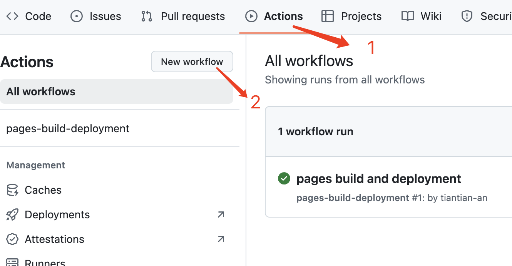
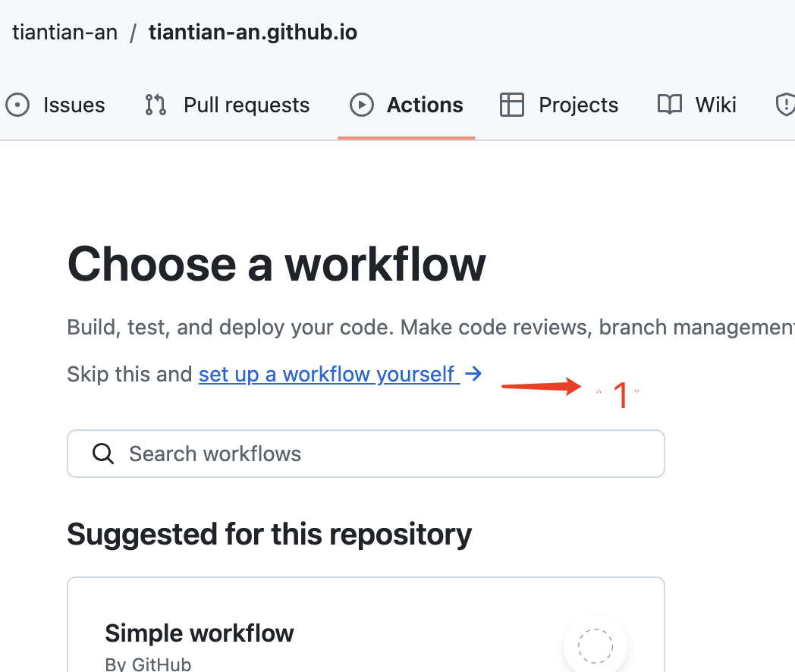
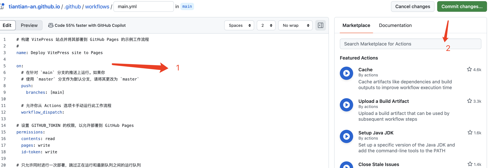

# 在Github上搭建VitePress站点
::: tip
前面看到一个同行的一篇文章，结果发现他的网站的风格也是我想要的。而我自己也没有一个地方来记录我的那些杂七杂八的生活工作。所以收藏了下来。今天工作也不忙，所以也来部署一个自己的站点。也一并记录这套流程，毕竟记性真的不太好。
:::
## 创建一个vitePress项目
````
mkdir 项目名称
cd 项目名称
pnpm add -D vitepress vue
pnpm vitepress init
````
这一步之后，会弹出一些默认的配置，可以全都回车直接使用默认配置。完成了！


## 使用Github Actions部署
**首先在Github上创建一个仓库**

如果将站点部署在http://username.github.io上,则可以不用配置.vitepress文件中的config.mts文件中的base属性，且在Github中创建username.github.io的仓库；如果将站点部署在子路径上，eg：http://username.github.io/blog 则需要配置base属性为‘/blog/’,且在Github中创建blog的仓库。


**然后，将代码提交上去**

**到github仓库中设置source为github Actions**


**到Action中创建工作流**


**部署配置文件deploy.yml**


这个时候从https://vitepress.dev/zh/guide/deploy#github-pages 复制出deploy.yml的代码粘贴在这里,因为我是用的pnpm所以需要修改一下,然后在提交

```
# 构建 VitePress 站点并将其部署到 GitHub Pages 的示例工作流程
#
name: Deploy VitePress site to Pages

on:
  # 在针对 `main` 分支的推送上运行。如果你
  # 使用 `master` 分支作为默认分支，请将其更改为 `master`
  push:
    branches: [main]

  # 允许你从 Actions 选项卡手动运行此工作流程
  workflow_dispatch:

# 设置 GITHUB_TOKEN 的权限，以允许部署到 GitHub Pages
permissions:
  contents: read
  pages: write
  id-token: write

# 只允许同时进行一次部署，跳过正在运行和最新队列之间的运行队列
# 但是，不要取消正在进行的运行，因为我们希望允许这些生产部署完成
concurrency:
  group: pages
  cancel-in-progress: false

jobs:
  # 构建工作
  build:
    runs-on: ubuntu-latest
    steps:
      - name: Checkout
        uses: actions/checkout@v4
        with:
          fetch-depth: 0 # 如果未启用 lastUpdated，则不需要
      - uses: pnpm/action-setup@v3 # 如果使用 pnpm，请取消此区域注释
        with:
          version: 9
      # - uses: oven-sh/setup-bun@v1 # 如果使用 Bun，请取消注释
      - name: Setup Node
        uses: actions/setup-node@v4
        with:
          node-version: 20
          cache: pnpm # 或 pnpm / yarn
      - name: Setup Pages
        uses: actions/configure-pages@v4
      - name: Install dependencies
        run: pnpm install # 或 pnpm install / yarn install / bun install
      - name: Build with VitePress
        run: pnpm docs:build # 或 pnpm docs:build / yarn docs:build / bun run docs:build
      - name: Upload artifact
        uses: actions/upload-pages-artifact@v3
        with:
          path: docs/.vitepress/dist

  # 部署工作
  deploy:
    environment:
      name: github-pages
      url: ${{ steps.deployment.outputs.page_url }}
    needs: build
    runs-on: ubuntu-latest
    name: Deploy
    steps:
      - name: Deploy to GitHub Pages
        id: deployment
        uses: actions/deploy-pages@v4
```
**然后等待Actions部署完成，再去访问域名，就部署好了...**